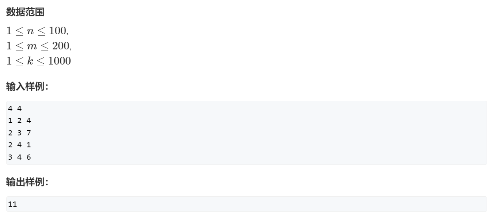

# 题目


# 输入输出



# 分析&代码如下

## Dijkstra算法实现

```cpp
#include <iostream>
#include <cstring>
#include <cstdio>
#include <vector>


using namespace std;
/**
 * 分析题意我们可以发现，这道题就是从指挥部开始求到每个点的最短路
 * 然后找出每个点到指挥部最短距离的最大值即可
 */ 
 
struct node{
  int to;//from是边的起点，to为边的终点
  int dis;//边的权值
};

const int N = 110;
int dist[N];//d[i]表示起点到i的最短距离
bool vis[N];//vis[i]表示第i个点的最短距离是否已经被确定
vector<node>G[N];
int n,m,flag = 0;

int main()
{
    scanf("%d %d",&n,&m);
    for(int i = 0;i < m;i++)
    {
        int a,b,w;
        scanf("%d %d %d",&a,&b,&w);//一个小坑，这题是无向图
        G[a].push_back({b,w});
        G[b].push_back({a,w});
    }
  
  
    memset(dist,0x3f,sizeof dist);
    //指挥部是第一个哨所
    dist[1] = 0;
    for(int i = 0;i < n;i++)
    {
        int t = -1;
        for(int j = 1;j <= n;j++)//找出尚未确定点中距离起点最小的点
        {
            if(!vis[j] && (t == -1 || dist[t] > dist[j]))
            {
                t = j;
            }
        }
        vis[t] = true;//找到距离起点最小的点之后就标记
        //根据t对应的点来更新其他点到起点的最短距离
        for(int k = 0;k < G[t].size();k++)
        {
            int b = G[t][k].to,distance = G[t][k].dis;
            dist[b] = min(dist[b],dist[t] + distance);
        
        }
    }
  
  
        int res = 0;
        for(int i = 1;i <= n;i++)
        {
            res = max(res,dist[i]);
        }
        if(res != 0x3f3f3f3f) printf("%d",res);
        else puts("-1");
  
  
  
  
    return 0;
}
```

## Floyd算法实现

```cpp
#include <iostream>
#include <cstring>

using namespace std;

const int N = 110,INF = 0x3f3f3f3f;
int n,m,ans = 0;
int dist[N][N];

int main(){
    memset(dist,0x3f,sizeof dist);
  
    cin >> n >> m;
    for(int i = 0;i < m;i++){
        int a,b,c;
        cin >> a >> b >> c;
        dist[a][b] = dist[b][a] = min(dist[a][b],c);
    }
  
    for(int k = 1;k <= n;k++){
        for(int i = 1;i <= n;i++){
            for(int j = 1;j <= n;j++){
                dist[i][j] = min(dist[i][j],dist[i][k] + dist[k][j]);
            }
        }
    }
  
    for(int i = 2;i <= n;i++){
        ans = max(ans,dist[1][i]);
    }
    if(ans == INF) cout << -1 <<endl;
    else cout << ans << endl;
  
    return 0;
}
```
